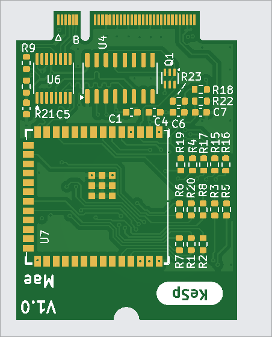
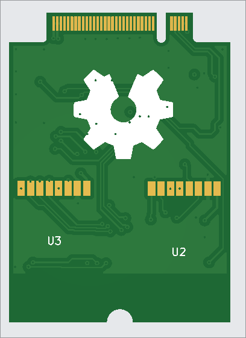

# KeSp_dongle

USB receiver dongles for the **Niphargus** wireless split keyboard, and soon
for the **Conchodytes** mouse. Both talk 2.4 GHz over nRF24L01+ and share this
single receiver, which presents itself to the host as a USB HID device.

Each Niphargus half is self-contained — its own ESP32-S3-WROOM-1, nRF24L01+ and
16340 cell — and transmits on its own link. Hence the two radios on the dongle,
one per half. The mouse will join on an additional pipe or in a later revision.

KiCad 10 projects. Ecosystem: [Niphargus](https://github.com/mornepousse/Niphargus) (keyboard),
[Conchodytes](https://github.com/mornepousse/Conchodytes) (mouse),
[KeSp_firmware](https://github.com/mornepousse/KeSp_firmware),
[KeSp_software](https://github.com/mornepousse/KeSp_software).

*[Version française plus bas](#version-française).*

| Top | Bottom |
|---|---|
|  |  |

`dongle-REV1` in revision **V1.0** — the board currently in service.
Top: the CH334R (U6), the CH340C (U4), the ESP32-S3-WROOM-1 (U7) and the M.2
Key B card edge. Bottom: the two NRF24L01+ modules (U2 and U3) on their 2 mm
headers, one per keyboard half.

## The variants

| Folder | MCU | Form factor | Status |
|---|---|---|---|
| `dongle-REV1/` | ESP32-S3-WROOM-1 | M.2 Key B 3042 (30 × 42 mm) | **in service** — V1.0 running in a Dell Latitude 5430's M.2 slot for several months |
| `dongle-REV2/` | ESP32-S3-WROOM-1 | M.2 Key B 3042 (30 × 42 mm) | current design — hub dropped, M.2 CONFIG pins declared, bench supply added; not manufactured yet |
| `dongle-ext/` | ESP32-S3-WROOM-1 | 2.54 mm headers, no M.2 card edge | prototype |

`dongle-REV1` is the only design proven in real use: it enumerates and works as
a USB HID keyboard in the Latitude's M.2 WWAN slot. It does **not** work in a
ThinkPad P16 Gen 1 — the reason, and what REV2 does about it, are written up in
[`docs/hote-thinkpad-p16.md`](docs/hote-thinkpad-p16.md).

## `dongle-REV1` architecture

**Radio** — 2x NRF24L01+ on a shared SPI bus, one per Niphargus half.
Separate CSN/CE/IRQ lines, 100 Ω series resistors on every signal. The
Conchodytes mouse is not wired in yet: it will either share a radio through an
extra receive pipe (the nRF24L01+ handles six) or get its own in a revision.

**USB** — the M.2 slot provides a single USB 2.0 link, split by a hub:

```
M.2 pins 7/9 (D+/D-)
        │
        └─ CH334R (USB 2.0 hub, QSOP-16, crystal-free mode: XI → GND)
             ├── port 1 → ESP32-S3 native USB   (HID in production)
             ├── port 2 → CH340C                (flash and debug without unplugging)
             └── ports 3-4 → unused
```

The CH334R runs natively at 3.3 V with its internal LDO bypassed: **pin 12
(5V) and pin 13 (VDD33) are both tied to 3.3 V**. Leaving pin 12 floating
makes the part overheat and prevents USB enumeration — the classic trap with
this package.

**Power** — no onboard regulator, 3.3 V comes straight from the M.2 slot
(pins 2, 4, 70, 72, 74; grounds on 3, 5, 11, 71, 73).

**M.2 control signals** — `W_DISABLE1#` and `FULL_CARD_POWER_OFF#` get 10 kΩ
pull-ups to 3.3 V, so the host cannot disable the card at boot. `RESET#` is
different: R22 carries it into the ESP32-S3's `EN` node, which also holds a
10 kΩ pull-up (R19) and 100 nF to ground (C7). **The host can therefore reset
the module** — worth remembering when a slot behaves oddly.

| Signal | M.2 pin | Part | Goes to |
|---|---|---|---|
| `W_DISABLE1#` | 8 | R21, 10 kΩ | +3.3 V — pull-up |
| `FULL_CARD_POWER_OFF#` | 6 | R23, 10 kΩ | +3.3 V — pull-up |
| `RESET#` | 67 | R22, 10 kΩ | ESP32-S3 `EN` |

**Auto-reset** — one UMH3N (a dual transistor in SOT-363) driven from the
CH340C DTR/RTS lines to EN and IO0.

## What changed in `dongle-REV2`

REV1 declares nothing on the M.2 CONFIG pins, so a host that reads them before
powering the slot sees "no card present" and never delivers 3.3 V. That is what
happens on a ThinkPad P16 Gen 1. REV2 answers it, and simplifies the USB path
on the way:

| Change | Why |
|---|---|
| `JP2`–`JP5`: CONFIG_0..3 to GND, **open** by default | Lets a code be declared with a solder blob, and swept per host, without a new PCB |
| CH334R hub (`U6`) removed, with `C6` and `J3` | The host now sees a single device whose VID/PID the firmware owns; also retires the CH334R 3.3 V trap |
| ESP32-S3 (`U7:13/14`) straight onto `J2:9/7` | The M.2 USB 2.0 link with nothing in between |
| CH340C (`U4`) moved to `J1` (1 GND, 2 D−, 3 D+, 4 VBUS) | Serial console and auto-reset kept, as a bench programming port |
| `U1` LD1117S33 + `C13`/`C14`, preceded by `D1` (SS14) | Runs the board from the bench cable's VBUS. The series Schottky blocks the slot's 3.3 V from feeding back to the connector through the regulator's internal parasitic path |
| `JP6` between the LDO output and the `+3.3V` rail, **open** by default | Stops the LDO from powering the laptop's WWAN rail when the bench cable is plugged with the card inserted. `C13` stays on the LDO side, so the regulator keeps its output capacitor with the jumper open |

Flashing without unplugging used to go through the CH340C behind the hub. It
now goes through the ESP32-S3's own USB Serial/JTAG over the M.2 link: its
CDC-ACM "supports host controllable chip reset and entry into download mode"
(ESP32-S3 TRM v1.8, p. 1244). Note that the internal USB PHY is **shared**
between USB-OTG and USB Serial/JTAG, one at a time (p. 1244-1245): while the
firmware holds the PHY in OTG for HID, the serial console is gone.

Checked with `kicad-cli` on 2026-09-22: **0 schematic/PCB parity issues, 0
unconnected items**, 41 components on each side.

## Libraries

Custom footprints live in `libs/` and are referenced as
`${KIPRJMOD}/../libs/…` by each project's `fp-lib-table` — no absolute paths,
so the repository clones anywhere.

| Library | Contents |
|---|---|
| `libs/MaeLid.pretty` | NRF24L01, ESP32-S3-DevKitC, JC-ESP32P4-M3, logo |
| `libs/M.2-cards` | M.2 card outline templates |
| `libs/NGFF.pretty` | M.2 / NGFF connectors |

Everything else comes from the standard KiCad libraries and from
`PCM_Espressif` (Plugin and Content Manager, install separately).

## Open items

- `dongle-REV2`: **no clearance exception on `J2`**. 58 of the DRC's 102
  violations are simply adjacent M.2 gold fingers at 0.150 mm against a
  0.200 mm rule. Until an exception is set, the DRC is red by default and
  stops being useful.
- `dongle-REV2`: leftovers to clean — two real clearance violations (`C9` pad
  vs the `/IO0` via at 0.175 mm, GND copper vs `J2:9` at 0.150 mm), a dangling
  via on the VBUS net, a 14 µm dangling track on `/D-_ESP32`, and two
  single-spoke thermal reliefs (`C13`, `J1`).
- `dongle-REV2`: `C8` through `C14` carry `Resistor_SMD:R_1206_3216Metric`.
  Same land pattern, but the BOM and JLCPCB files will describe a resistor
  footprint for 10 µF capacitors. `C14` at 10 µF also sits exactly on the bulk
  capacitance a USB 2.0 device may present on VBUS.
- `dongle-REV2`: `J1` is wired 1 = GND, 2 = D−, 3 = D+, 4 = VBUS, the reverse
  of a USB-A cable's order. The pigtail must be built to match.
- Whether the P16 Gen 1 powers its WWAN slot at all, and on which CONFIG code,
  is still unmeasured. The test costs a wire on an existing V1.0 board — see
  [`docs/hote-thinkpad-p16.md`](docs/hote-thinkpad-p16.md).

## Fabrication

| Folder | Output | Exported |
|---|---|---|
| `dongle-REV1/Gerber/` | gerbers of the manufactured V1.0 batch | 2026-05-27 |
| `dongle-REV1/jlcpcb/` | JLCPCB set — gerbers, BOM, CPL | 2026-08-22 |
| `dongle-REV2/jlcpcb/` | JLCPCB set — gerbers, BOM, CPL | 2026-09-22, after `JP6` |
| `dongle-ext/Gerber/` | gerbers | 2026-06-04 |

REV2's export is in sync with its source, but none of the open items above are
fixed in it — the dangling via and track, the two real clearance violations.
Clean those before ordering.

The REV1 gerbers match the batch that was manufactured, revision V1.0. That
source has since moved on: R9 removed, decoupling completed (C8 through C12),
and the `JP2`–`JP5` CONFIG jumpers added — so `dongle-REV1/` no longer
describes the board sitting in the Latitude.

Neither exported netlists (`*.net`) nor fabrication archives (`*.zip`) are
version-controlled: both regenerate from the source, and importing a stale
netlist overwrites current work.

## Documentation

- [`docs/hote-thinkpad-p16.md`](docs/hote-thinkpad-p16.md) — why the M.2 WWAN
  slot of a ThinkPad P16 Gen 1 never powers the card, the M.2 CONFIG pins, what
  other USB cards in M.2 slots do, the test protocol, and REV2's state.

---

# Version française

Dongles USB récepteurs pour le clavier split sans fil **Niphargus**, et
bientôt pour la souris **Conchodytes**. Les deux émettent en 2,4 GHz via un
nRF24L01+ et partagent ce même récepteur, qui se présente au PC en USB HID.

Chaque moitié du Niphargus est autonome — son ESP32-S3-WROOM-1, son nRF24L01+
et sa cellule 16340 — et émet sur son propre lien. D'où les deux radios du
dongle, une par moitié. La souris arrivera sur un pipe supplémentaire ou dans
une révision ultérieure.

Projets KiCad 10. Écosystème : [Niphargus](https://github.com/mornepousse/Niphargus) (clavier),
[Conchodytes](https://github.com/mornepousse/Conchodytes) (souris),
[KeSp_firmware](https://github.com/mornepousse/KeSp_firmware),
[KeSp_software](https://github.com/mornepousse/KeSp_software).

Les rendus plus haut montrent `dongle-REV1` en révision **V1.0**, la carte
actuellement en service. Dessus : le CH334R (U6), le CH340C (U4),
l'ESP32-S3-WROOM-1 (U7) et le bord de carte M.2 Key B. Dessous : les deux
NRF24L01+ (U2 et U3) sur leurs embases 2 mm, un par moitié de clavier.

## Les variantes

| Dossier | MCU | Format | État |
|---|---|---|---|
| `dongle-REV1/` | ESP32-S3-WROOM-1 | M.2 Key B 3042 (30 × 42 mm) | **en service** — V1.0 montée dans le slot M.2 d'un Dell Latitude 5430 depuis plusieurs mois |
| `dongle-REV2/` | ESP32-S3-WROOM-1 | M.2 Key B 3042 (30 × 42 mm) | conception courante — hub supprimé, pins CONFIG déclarées, alimentation de banc ajoutée ; pas encore fabriquée |
| `dongle-ext/` | ESP32-S3-WROOM-1 | connecteurs 2,54 mm, pas de bord M.2 | prototype |

`dongle-REV1` est la seule éprouvée à l'usage : elle énumère et fonctionne en
clavier USB HID dans le slot M.2 WWAN du Latitude. Elle **ne fonctionne pas**
dans un ThinkPad P16 Gen 1 — la raison, et ce que REV2 y répond, sont
consignées dans [`docs/hote-thinkpad-p16.md`](docs/hote-thinkpad-p16.md).

## Architecture de `dongle-REV1`

**Radio** — 2x NRF24L01+ sur bus SPI partagé, un par moitié de Niphargus.
CSN/CE/IRQ séparés, résistances série de 100 Ω sur chaque signal. La souris
Conchodytes n'est pas encore câblée : elle partagera une radio via un pipe de
réception supplémentaire (le nRF24L01+ en gère six) ou aura la sienne dans une
révision.

**USB** — le slot M.2 fournit un seul lien USB 2.0, dédoublé par un hub :

```
M.2 pins 7/9 (D+/D-)
        │
        └─ CH334R (hub USB 2.0, QSOP-16, mode sans quartz : XI → GND)
             ├── port 1 → USB natif de l'ESP32-S3   (HID en production)
             ├── port 2 → CH340C                    (flash et debug sans démonter)
             └── ports 3-4 → non utilisés
```

Le CH334R tourne en 3,3 V natif, LDO interne bypassé : **pin 12 (5V) et
pin 13 (VDD33) toutes deux au 3,3 V**. Laisser la pin 12 flottante fait
chauffer le composant et empêche l'énumération — c'est le piège de ce boîtier.

**Alimentation** — aucun régulateur embarqué, le 3,3 V vient directement du
slot M.2 (pins 2, 4, 70, 72, 74 ; masses sur 3, 5, 11, 71, 73).

**Signaux M.2** — `W_DISABLE1#` et `FULL_CARD_POWER_OFF#` reçoivent des
pull-ups de 10 kΩ vers 3,3 V, pour que la carte ne soit pas désactivée au
démarrage. `RESET#` est différent : R22 l'amène sur le nœud `EN` de
l'ESP32-S3, qui porte aussi un pull-up de 10 kΩ (R19) et 100 nF vers la masse
(C7). **L'hôte peut donc réinitialiser le module** — bon à savoir quand un slot
se comporte bizarrement.

| Signal | Pin M.2 | Composant | Va vers |
|---|---|---|---|
| `W_DISABLE1#` | 8 | R21, 10 kΩ | +3,3 V — pull-up |
| `FULL_CARD_POWER_OFF#` | 6 | R23, 10 kΩ | +3,3 V — pull-up |
| `RESET#` | 67 | R22, 10 kΩ | `EN` de l'ESP32-S3 |

**Reset automatique** — un UMH3N (double transistor en SOT-363) piloté par les
lignes DTR/RTS du CH340C vers EN et IO0.

## Ce qui change dans `dongle-REV2`

REV1 ne déclare rien sur les pins CONFIG du M.2 : un hôte qui les lit avant
d'alimenter le slot comprend « pas de carte » et ne délivre jamais le 3,3 V.
C'est ce qui se passe sur un ThinkPad P16 Gen 1. REV2 y répond, et simplifie le
chemin USB au passage :

| Modification | Raison |
|---|---|
| `JP2`–`JP5` : CONFIG_0..3 vers GND, **ouverts** par défaut | Permet de déclarer un code à la goutte de soudure, et de les balayer selon l'hôte, sans refaire un PCB |
| Hub CH334R (`U6`) supprimé, avec `C6` et `J3` | L'hôte ne voit plus qu'un périphérique, dont le firmware maîtrise le VID/PID ; supprime aussi le piège du 3,3 V du CH334R |
| ESP32-S3 (`U7:13/14`) directement sur `J2:9/7` | Le lien USB 2.0 du M.2 sans rien entre les deux |
| CH340C (`U4`) déplacé sur `J1` (1 GND, 2 D−, 3 D+, 4 VBUS) | Console série et auto-reset conservés, en port de programmation de banc |
| `U1` LD1117S33 + `C13`/`C14`, précédé de `D1` (SS14) | Alimente la carte depuis le VBUS du câble de banc. Le Schottky en série bloque le retour du 3,3 V du slot vers le connecteur par le parasite interne du régulateur |
| `JP6` entre la sortie du LDO et le rail `+3.3V`, **ouvert** par défaut | Empêche le LDO d'alimenter le rail WWAN du portable si le câble de banc est branché carte insérée. `C13` reste côté LDO, qui garde donc sa capacité de sortie jumper ouvert |

Le « flash sans démonter » que permettait le CH340C derrière le hub passe
désormais par l'USB Serial/JTAG de l'ESP32-S3 sur la liaison M.2 : son CDC-ACM
« supports host controllable chip reset and entry into download mode »
(ESP32-S3 TRM v1.8, p. 1244). À noter que le PHY USB interne est **partagé**
entre l'USB-OTG et l'USB Serial/JTAG, un seul à la fois (p. 1244-1245) : tant
que le firmware tient le PHY en OTG pour le HID, la console série disparaît.

Vérifié au `kicad-cli` le 22/09/2026 : **0 problème de parité schéma/PCB, 0
élément non connecté**, 41 composants de chaque côté.

## Bibliothèques

Les empreintes maison vivent dans `libs/` et sont référencées en
`${KIPRJMOD}/../libs/…` par le `fp-lib-table` de chaque projet — aucun chemin
absolu, le dépôt se clone n'importe où.

| Lib | Contenu |
|---|---|
| `libs/MaeLid.pretty` | NRF24L01, ESP32-S3-DevKitC, JC-ESP32P4-M3, logo |
| `libs/M.2-cards` | gabarits de cartes M.2 |
| `libs/NGFF.pretty` | connecteurs M.2 / NGFF |

Le reste vient des bibliothèques standard KiCad et de `PCM_Espressif`
(gestionnaire de contenu, à installer séparément).

## Points ouverts

- `dongle-REV2` : **aucune exception d'isolation posée sur `J2`**. 58 des 102
  violations du DRC ne sont que des doigts dorés M.2 voisins, à 0,150 mm contre
  une règle à 0,200 mm. Tant que l'exception n'est pas posée, le DRC est rouge
  par construction et cesse d'être utile.
- `dongle-REV2` : restes à nettoyer — deux isolations réelles (pad de `C9`
  contre la via `/IO0` à 0,175 mm, cuivre GND contre `J2:9` à 0,150 mm), une
  via orpheline sur le net VBUS, une piste orpheline de 14 µm sur `/D-_ESP32`,
  et deux freins thermiques à un seul rayon (`C13`, `J1`).
- `dongle-REV2` : `C8` à `C14` portent `Resistor_SMD:R_1206_3216Metric`. Même
  pastille, mais la BOM et les fichiers JLCPCB décriront une empreinte de
  résistance pour des condensateurs de 10 µF. `C14` à 10 µF est par ailleurs
  exactement à la capacité de bulk maximale qu'un périphérique USB 2.0 peut
  présenter sur VBUS.
- `dongle-REV2` : `J1` est câblé 1 = GND, 2 = D−, 3 = D+, 4 = VBUS, soit
  l'inverse de l'ordre d'un câble USB-A. Le pigtail doit être fait en
  conséquence.
- Savoir si le P16 Gen 1 alimente son slot WWAN, et sur quel code CONFIG, n'est
  toujours pas mesuré. L'essai coûte un fil sur une V1.0 existante — voir
  [`docs/hote-thinkpad-p16.md`](docs/hote-thinkpad-p16.md).

## Fabrication

| Dossier | Sortie | Exporté le |
|---|---|---|
| `dongle-REV1/Gerber/` | gerbers de la série V1.0 fabriquée | 27/05/2026 |
| `dongle-REV1/jlcpcb/` | jeu JLCPCB — gerbers, BOM, CPL | 22/08/2026 |
| `dongle-REV2/jlcpcb/` | jeu JLCPCB — gerbers, BOM, CPL | 22/09/2026, après `JP6` |
| `dongle-ext/Gerber/` | gerbers | 04/06/2026 |

L'export de REV2 est à jour vis-à-vis de sa source, mais aucun des points
ouverts ci-dessus n'y est corrigé — la via et la piste orphelines, les deux
isolations réelles. À nettoyer avant toute commande.

Les gerbers de REV1 correspondent à la série reçue, en révision V1.0. Cette
source a depuis évolué : R9 supprimée, découplage complété (C8 à C12), et
jumpers CONFIG `JP2`–`JP5` ajoutés — `dongle-REV1/` ne décrit donc plus la
carte montée dans le Latitude.

Ni les netlists exportées (`*.net`) ni les archives de fabrication (`*.zip`) ne
sont versionnées : les deux se régénèrent depuis la source, et importer une
netlist périmée écrase le travail en cours.

## Documentation

- [`docs/hote-thinkpad-p16.md`](docs/hote-thinkpad-p16.md) — pourquoi le slot
  M.2 WWAN d'un ThinkPad P16 Gen 1 n'alimente jamais la carte, les pins CONFIG
  du M.2, ce que font les autres cartes USB en slot M.2, le protocole d'essai,
  et l'état de REV2.
